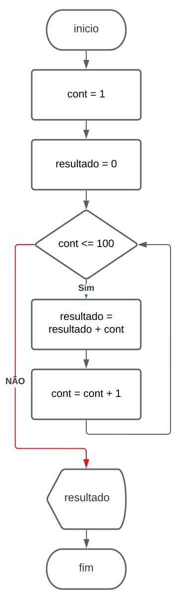

# 003 - While Loop

# a) João tem 1,34m de altura e Pedro tem 1,45m. João cresce 2,5cm por ano e Pedro cresce 2cm por ano. Quantos anos irá demorar para João ficar mais alto que Pedro?

## Algoritmo:

```
1 - Defina a altura de João em cm (alturaJoao = 134)
2 - Defina a altura de Pedro em cm (alturaPedro = 145)
3 - Defina o ano (ano = 1)
4 - Enquanto (alturaPedro >= alturaJoao) faça do passo 5 ao 7
		5 - Aumente a altura de João (alturaJoao = alturaJoao + 2.5)
		6 - Aumente a altura de Pedro (alturaPedro = alturaPedro + 2.0)
		7 - Incrementar o ano (ano = ano + 1)
8 - Apresente quantos anos João levou para ser maior que Pedro (ano)
```

## Fluxograma:


## Portugol:

```jsx
programa ALTURA
var
		ano : inteiro
		alturaPedro, alturaJoao : real

inicio
		alturaJoao = 134
		alturaPedro = 145
		ano = 1
		enquanto (alturaPedro >= alturaJoao) faça
				alturaJoao = alturaJoao + 2.5
				alturaPedro = alturaPedro + 2.0
				ano = ano + 1
		fim_enquanto
		escreva(ano)
fim
```

## Java:

```java
public class Ex001 {

    public static void main(String[] args) {
        double alturaJoao = 134.0;
        double alturaPedro = 145.0;
        int ano = 1;

        while(alturaPedro >= alturaJoao) {
            alturaJoao  += 2.5;
            alturaPedro += 2.0;
            ano++;
        }
        System.out.println("Levaram " + ano + " anos para João ficar mais alto que Pedro.");
    }
}
```

# b) Criar um programa que apresente a tabuada de um número inteiro informado pelo usuário.

## Algoritmo:

```
1 - Leia um número digitado pelo usuário (num)
2 - Inicie o contador (i = 1)
3 - Enquanto (i <= 10) faça do passo 4 ao 6
		4 - Calcule o resultado (resultado = num * i)
		5 - Apresente o resultado (resultado)
		6 - Incremente o contador (i = i + 1)
```

## Fluxograma:


## Portugol:

```jsx
programa TABUADA
var
		num, i : inteiro

inicio
		leia (num)
		i = 1
		enquanto (i <= 10) faça
				resultado = num * i
				escreva(resultado)
				i = i + 1
		fim_enquanto
fim
```

## Java:

```java
import java.io.*;

public class Ex002 {

    public static void main(String[] args) throws IOException {

        BufferedReader in = new
                BufferedReader(new InputStreamReader(System.in));

        int num, i = 1;

        System.out.println("Digite um número:");
        num = Integer.parseInt(in.readLine());

        while (i <= 10) {
            System.out.println(num + " x " + i + " = " + (num*i));
            i++;
        }
    }
}
```

# c) Criar um programa que apresente a somatória dos números de 1 a 100.

## Algoritmo:

```
1 - Defina o contador (cont = 1)
2 - Inicie a variavel resultado (resultado = 0)
3 - Enquanto (cont <= 100) faça do passo 4 ao 5
		4 - Defina o valor do resultado (resultado = resultado + cont)
		5 - Incremente o contador (cont = cont + 1)
6 - Apresente o resultado (resultado)
```

## Fluxograma:



## Portugol:

```jsx
programa SOMA
var
		cont, resultado : inteiro

inicio
		cont = 1
		resultado = 0
		enquanto (cont <= 100) faça
				resultado = resultado + cont
				cont = cont + 1
		fim_enquanto
		escreva(resultado)
fim
```

## Java:

```java
public class Ex003 {

    public static void main(String[] args) {
        int cont = 1;
        int result = 0;
        while (cont <= 100) {
            result += cont;
            cont++;
        }
        System.out.println(result);
    }
}
```

# d) Criar um programa que calcule e apresente o fatorial de um número inteiro apresentado pelo usuário.

Obs.: O fatorial de um número é obtido por meio do cálculo:
5! = 5*4*3*2*1 = 120

## Algoritmo:

```
1- Leia a base(i)
2- Defina o fatorial (fatorial = 1)
3- Enquanto (i > 0) faça do passo 4 ao 5
		4- Calcule o fatorial (fatorial = fatorial * i)
		5- Reduza o contador (i = i - 1)
6- Apresente o resultado final (fatorial)
```

## Fluxograma:


## Portugol:

```jsx
programa FATORIAL
var
		i, fatorial: inteiro

inicio 
		leia (i)
		fatorial = 1
		enquanto (i>0) faça
				fatorial = fatorial * i 
				i = i - 1
		fim_escolha
		escreva (fatorial)
fim
```

## Java:

```java
import java.util.Scanner;

public class Ex004 {

    public static void main(String[] args) {
        Scanner ler = new Scanner(System.in);
        int i, fatorial = 1;
        System.out.println("Insira um número à ser fatorado: ");
        i = ler.nextInt();
        while (i>0){
            fatorial = fatorial * i;
            i--;
        }
        System.out.println("O fatorial é: " + fatorial);
        ler.close();
    }
}
```

# e) Criar um programa que leia uma base e um expoente e apresente o cálculo da potência.

## Algoritmo:

```
1- Leia a base (base)
2- Leia o expoente (expoente)
3- Defina o contador (i = 1)
4- Defina a potência (potencia = 1)
5- Enquanto (i <= expoente) faça do passo 6 ao 7
		6- Calcule a potência (potencia = potencia * base)
		7- Incremente o contador (i = i + 1)
8- Apresente o resultado final (potencia)
```

## Fluxograma:


## Portugol:

```jsx
programa POTENCIA
var
		base, expoente, potencia, i: inteiro

inicio
		leia (base)
		leia (expoente)
		i = 1
		potencia = 1
		enquanto (i <= expoente) faça
				potencia = potencia * base
				i = i + 1
		fim_escolha
		escreva (potencia)
fim

```

## Java:

```java
import java.util.Scanner;

public class Ex005 {
    public static void main(String[] args) {

        Scanner ler = new Scanner(System.in);
        int i=1;
        int base, expoente, potencia = 1;

        System.out.println("Insira a base: ");
        base = ler.nextInt();
        System.out.println("Insira o expoente: ");
        expoente = ler.nextInt();
        ler.close();

        while (i<=expoente){
            potencia = potencia * base;
            i++;
        }

        System.out.println("A potência é: "+potencia);

    }
}
```